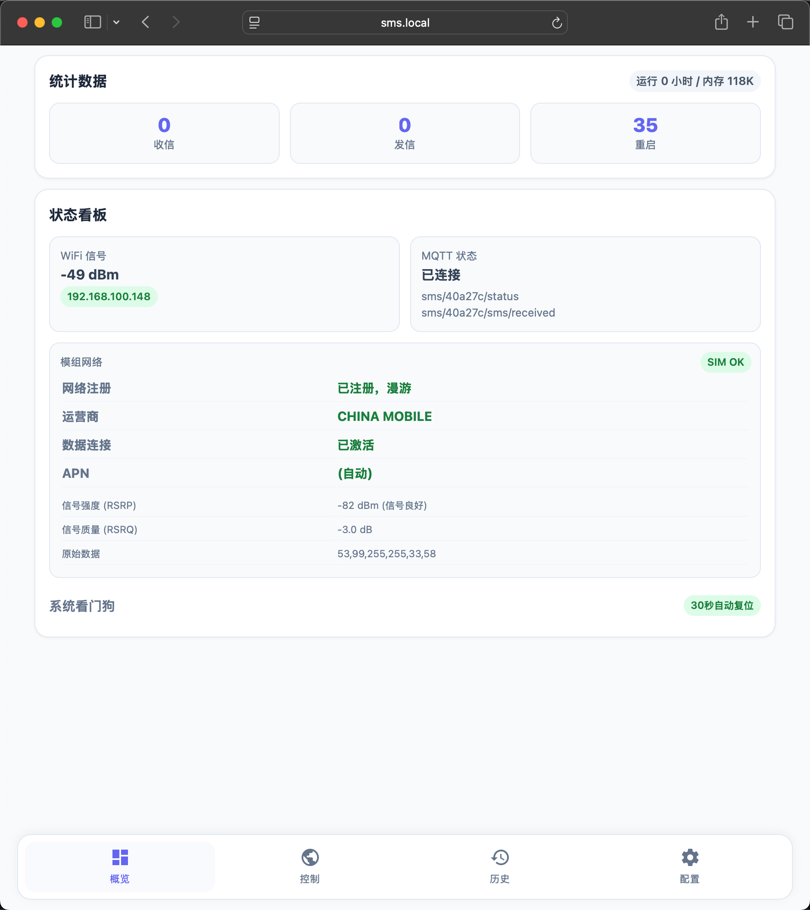
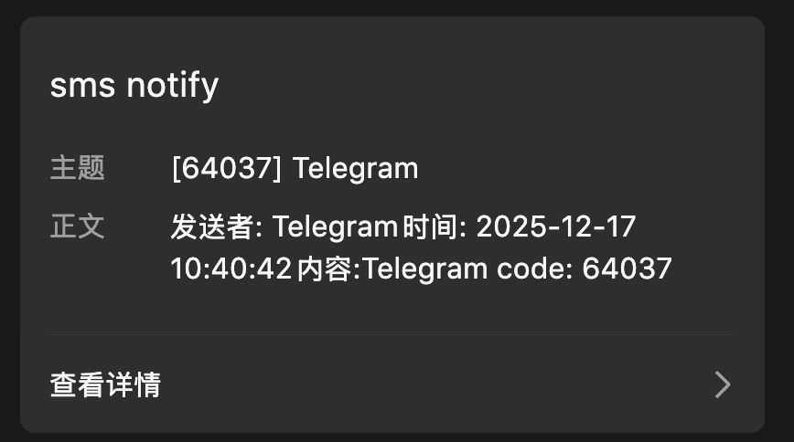
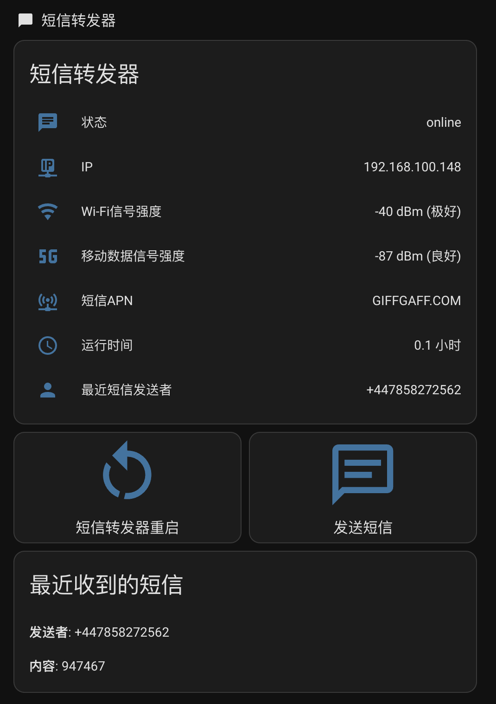
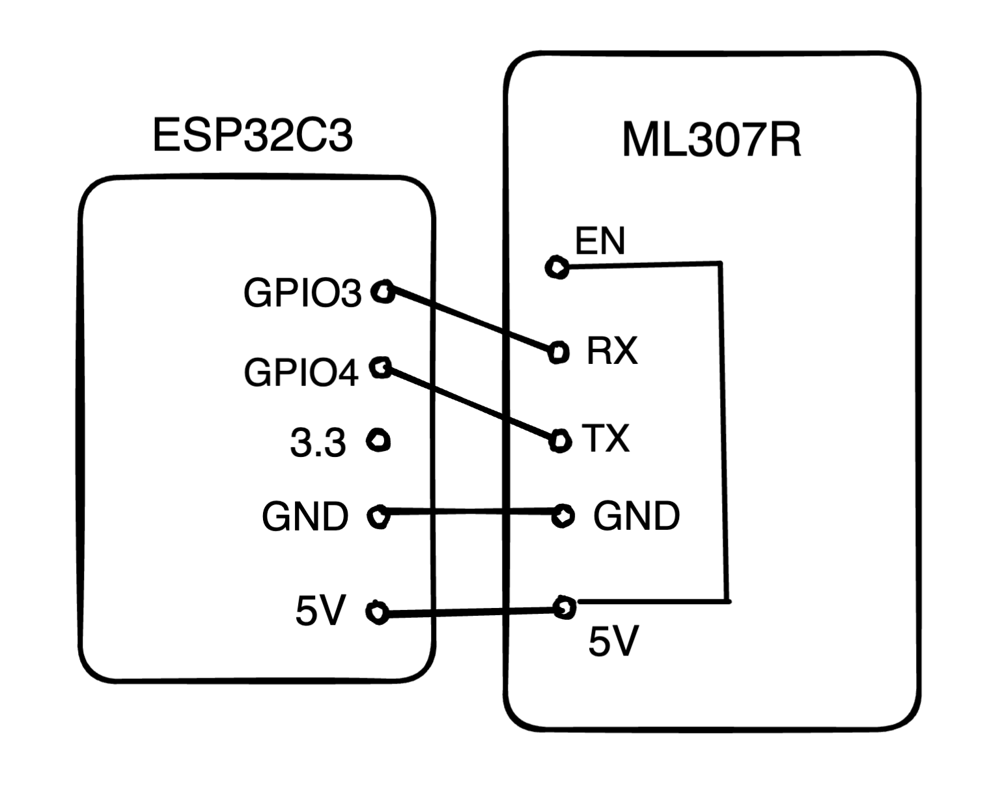
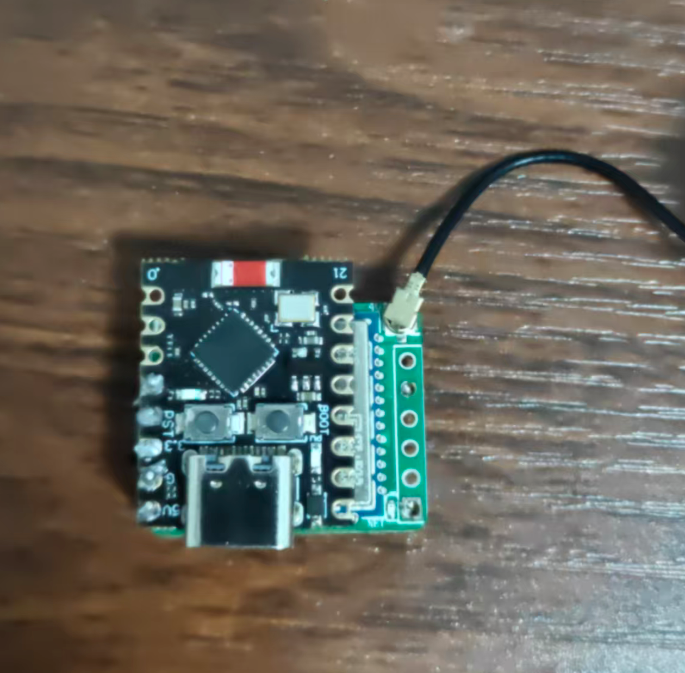

# 低成本短信/来电转发器

基于低成本硬件实现 **短信转发、来电提醒、远程发短信、MQTT 接入智能家居**。
只需要供电、SIM 卡和 WiFi，设备即可独立运行；收到短信或来电后，可转发到邮箱、Telegram、企业微信、钉钉、Bark、自定义 Webhook，或接入 Home Assistant。

> ⚠️ 项目当前主要基于 `ESP32-C3 + ML307R-DC` 组合开发与验证。虽然模块标记为“全网通”，但不同运营商/地区卡的兼容性可能存在差异，尤其是电信卡请自行测试。

## Credit

本项目基于 [kipp01/msg_forward](https://github.com/kipp01/msg_forward) 进行二次开发，原项目采用 MIT 协议。本项目保留原作者版权声明，并在此基础上增加/改动了功能。

原项目固件的视频教程：
- [B站视频](https://www.bilibili.com/video/BV1cSmABYEiX)

部分功能及 UI 设计参考：
- [dushixiang/uart_sms_forwarder](https://github.com/dushixiang/uart_sms_forwarder)

---

## 项目特性

### 核心能力
- 📩 收到短信后自动转发
- 📞 来电时自动推送提醒
- 📤 支持网页端和 MQTT 远程发短信
- 🌐 内置 Web 配置界面，无需反复改代码
- 🔐 Web 管理支持 Basic Auth 登录
- 🛜 支持最多 **3 组 WiFi**，自动选择可连接网络
- 📡 支持 MQTT 和 Home Assistant 自动发现
- 🗂️ 本地保存短信/来电历史与统计信息

### 推送能力
- ✉️ 邮件通知
- 📲 Bark 推送
- 🤖 Telegram Bot
- 💬 企业微信机器人
- 🪧 钉钉机器人（支持加签）
- 🔗 通用 JSON / GET / 自定义 Webhook 模板
- ✅ 最多同时启用 **3 个 Web 推送通道**，并可与邮件/MQTT 同时使用

### 过滤与保号
- 🚫 号码黑白名单过滤
- 🔍 短信内容关键词黑白名单过滤
- 🌍 自动处理 `+86` / `86` 等号码格式差异
- ⏰ 定时任务：
  - 定时 Ping 保活
  - 定时发短信保号

### 网络与运维
- 📶 支持查询 WiFi、SIM、运营商、APN、4G 信号等状态
- 🏠 支持 mDNS，可通过 `http://sms.local` 访问（取决于系统环境）
- 🔄 WiFi 连接失败时自动进入 AP 模式，便于重新配置
- 🐶 启用 30 秒看门狗，降低异常卡死风险

---

## 当前支持的通知方式

| 类型 | 说明 |
|---|---|
| 邮件 | 通过 SMTP 发信 |
| MQTT | 上报状态、短信、来电事件，并支持远程控制 |
| Bark | iPhone 推送 |
| Telegram Bot | 机器人消息推送 |
| 企业微信机器人 | 群机器人 Webhook |
| 钉钉机器人 | 群机器人 Webhook，支持签名 |
| POST JSON | 向任意 HTTP/HTTPS 接口 POST JSON |
| GET 请求 | 通过 URL Query 传参 |
| 自定义模板 | 自定义 JSON Body 模板 |

> 说明：固件中 **HTTP 推送通道最多 3 个**，邮件与 MQTT 为独立配置。

---

## 效果预览







---

## 硬件准备

总成本约 **28 元**：

| 硬件 | 价格 | 链接 |
|---|---:|---|
| ESP32C3 Super Mini | ¥9.5 | [淘宝](https://item.taobao.com/item.htm?id=852057780489&skuId=5813710390565) |
| ML307R-DC 核心板 | ¥16.3 | [淘宝](https://item.taobao.com/item.htm?id=797466121802&skuId=5722077108045) |
| 4G 天线 | ¥2 | 同上链接 |

### 接线方式

> 注意：ML307R 的 `RX/TX` 与开发板排针位置不是“上下垂直对应”，接线前请确认引脚位置。`EN` 需要接到 `5V(VCC)`，否则模块可能无法自动启动。

| 接线示意图 | 实物连接图 |
|:---:|:---:|
|  |  |

简要接线如下：
- ESP32 的 **GPIO3** → ML307 的 **RX**
- ESP32 的 **GPIO4** → ML307 的 **TX**
- **GND** → **GND**
- **5V** → **VCC** 和 **EN**

代码中的串口定义见 `code/config.h`：
- `TXD 3`
- `RXD 4`

---

## 固件依赖

### Arduino IDE
推荐使用 Arduino IDE 烧录。

### ESP32 开发板支持
在 Arduino IDE 中添加开发板管理器地址：

```text
https://espressif.github.io/arduino-esp32/package_esp32_index.json
```

然后安装：
- **esp32 by Espressif Systems**

### 需要安装的库
根据当前代码实际引用，至少需要：
- **ReadyMail** by Mobizt
- **pdulib** by David Henry
- **PubSubClient** by Nick O'Leary

> 其余如 `WiFi`、`WebServer`、`ESPmDNS`、`Preferences`、`SPIFFS` 等来自 ESP32 Arduino Core。

---

## 烧录步骤

### 1. 修改初始 WiFi
首次启动前，固件需要至少有一个可连接的 WiFi。请编辑 `code/wifi_config.h`：

```cpp
#define WIFI_SSID "你的WiFi名"
#define WIFI_PASS "你的WiFi密码"
```

> 首次烧录后，后续可在网页中继续配置最多 3 组 WiFi。

### 2. 选择开发板与分区
Arduino IDE 建议：
1. 开发板选择：**MakerGO ESP32 C3 SuperMini**（或兼容 ESP32-C3 开发板）
2. Partition Scheme 选择：**Huge App**
3. 端口选择对应的 COM 口

### 3. 上传固件
1. 使用 USB 连接 ESP32-C3
2. 编译并上传
3. 打开串口监视器，波特率 `115200`

---

## 首次启动与访问方式

设备启动流程大致如下：
1. 读取已保存配置
2. 尝试连接已启用的 WiFi 列表
3. 若 30 秒内未成功联网，则进入 **AP 模式**
4. 初始化 HTTP 服务、短信模块、NTP、MQTT 等

### 正常联网时
可尝试通过以下地址访问：
- `http://sms.local`
- 或串口日志中显示的设备 IP

### WiFi 连接失败时
设备会启动热点：
- 热点名：`SMS-Forwarder-AP`
- 默认地址通常为：`http://192.168.4.1`

### 默认 Web 登录账号
- 用户名：`admin`
- 密码：`admin123`

> 建议首次进入后立即修改 Web 管理密码。

---

## Web 界面功能

当前 Web 界面主要包含 4 个页面：
- **概览**：统计信息、WiFi/MQTT 状态、模块网络信息
- **控制**：网页发短信、手动 Ping 保活、重启设备
- **历史**：查看短信历史与来电历史
- **配置**：WiFi、Web 登录、邮件、推送通道、MQTT、过滤器、定时任务

### 已实现的 HTTP 接口
| 接口 | 方法 | 说明 |
|---|---|---|
| `/` | GET | 主界面 |
| `/save` | POST | 保存完整配置 |
| `/sendsms` | POST | 网页发送短信 |
| `/ping` | POST | 手动 Ping |
| `/timer` | POST | 保存定时任务 |
| `/query` | GET | 查询模组/WiFi/网络状态 |
| `/restart` | POST | 重启设备 |
| `/clearhistory` | POST | 清空短信/来电历史与统计 |
| `/history` | GET | 获取历史记录 |
| `/stats` | GET | 获取统计 |
| `/filter` | POST | 保存号码过滤 |
| `/contentfilter` | POST | 保存内容过滤 |

---

## 推送通道说明

### 1. 邮件通知
需要配置：
- SMTP 服务器
- 端口（默认 465）
- 发信账号
- 发信密码
- 收件邮箱

收到短信时：
- 若识别到 4~8 位验证码，邮件标题会优先使用验证码
- 否则使用“发送者 + 短信预览”作为标题

收到来电时：
- 会发送来电提醒邮件

### 2. Telegram Bot
配置方式：
1. 使用 `@BotFather` 创建机器人
2. URL 填写：
   ```text
   https://api.telegram.org/bot<你的Token>/sendMessage
   ```
3. `Key1` 填写 `Chat ID`

### 3. 企业微信机器人
- URL 填完整的机器人 Webhook 地址即可

### 4. 钉钉机器人
- URL 填机器人 Webhook 地址
- 如果启用了“加签”，则在 `Key1` 填入以 `SEC` 开头的签名密钥

### 5. 通用 Webhook
支持三种形式：

#### POST JSON
默认发送：
```json
{
  "sender": "xxx",
  "message": "xxx",
  "timestamp": "xxx"
}
```

#### GET 请求
自动拼接参数：
- `sender`
- `message`
- `timestamp`

#### 自定义模板
可在模板中使用占位符：
- `{sender}`
- `{message}`
- `{timestamp}`

> 注意：当前实现中自定义模板以 `application/json` 方式 POST，请确保目标接口能接收该内容类型。

---

## 来电提醒

当前代码除了短信转发外，还支持 **来电事件通知**：
- 通过 `+CLIP` / `+CLCC` 识别来电号码
- 支持号码过滤
- 记录来电历史
- 可通过：
  - 邮件通知
  - Webhook 通道通知
  - MQTT / Home Assistant 事件通知

另外，固件会对短时间重复来电进行去重，避免同一来电被重复推送。

---

## 过滤功能

支持两类过滤，可单独开启，也可同时使用。

### 1. 号码过滤
支持：
- **黑名单模式**：命中即拦截
- **白名单模式**：未命中即拦截

特性：
- 自动移除 `+`、空格、`-`、括号等符号
- 自动兼容 `+86` / `86` 前缀
- 支持后缀匹配，减少号码格式差异带来的问题

例如：
- `13800138000` 可匹配 `+8613800138000`
- `8613800138000` 也可匹配 `13800138000`

### 2. 内容关键词过滤
支持：
- **黑名单模式**：包含关键词则拦截
- **白名单模式**：不包含关键词则拦截

特性：
- 不区分大小写
- 多个关键词使用英文逗号分隔

示例：
```text
推广,优惠,贷款,办卡
```

```text
验证码,校验码,动态密码,银行
```

> 注意：短信会先写入本地历史，再进行转发过滤。也就是说，被过滤的短信不会继续推送，但仍可能在历史中看到。

---

## 定时任务 / 保号功能

固件内置两种定时任务：

### 1. 定时 Ping
- 到期后自动激活数据连接
- 执行 `AT+MPING` 进行保活
- 适合低成本流量保号场景

### 2. 定时发短信
- 到期后向指定号码发送指定内容
- 适合需要真实短信行为保号的场景

### 定时规则
- 定时周期单位为 **天**
- 代码中最小值限制为 **1 天**

---

## MQTT 功能

设备支持 MQTT 上报与控制。

### 主题格式
设备 ID 为 MAC 地址后 6 位，例如：`a1b2c3`。
若自定义前缀为 `sms`，则主题为：

#### 上报主题
| 主题 | 说明 |
|---|---|
| `sms/a1b2c3/status` | 设备状态/详细状态 |
| `sms/a1b2c3/sms/received` | 收到短信 |
| `sms/a1b2c3/call/received` | 收到来电 |
| `sms/a1b2c3/sms/sent` | 发送短信结果 |
| `sms/a1b2c3/ping/result` | Ping 结果 |

#### 订阅控制主题
| 主题 | 说明 |
|---|---|
| `sms/a1b2c3/sms/send` | 远程发短信 |
| `sms/a1b2c3/ping` | 远程执行 Ping |
| `sms/a1b2c3/cmd` | 控制命令 |

### 发送短信示例
发送到主题：`sms/a1b2c3/sms/send`

```json
{"phone":"13800138000","message":"测试短信"}
```

### Ping 示例
发送到主题：`sms/a1b2c3/ping`

```json
{"host":"8.8.8.8"}
```

若不传 `host`，默认目标为 `8.8.8.8`。

### 控制命令示例
发送到主题：`sms/a1b2c3/cmd`

```json
{"action":"restart"}
```

也支持：
```json
{"action":"status"}
```

### 设备状态上报
设备连接 MQTT 后：
- 连接成功会发布 `online`
- 异常离线会通过遗嘱消息发布 `offline`
- 每 **60 秒** 上报一次详细状态

状态 JSON 示例：

```json
{
  "status": "online",
  "device": "a1b2c3",
  "ip": "192.168.1.100",
  "wifi_rssi": -45,
  "wifi_status": "极好",
  "wifi_ssid": "MyWiFi",
  "uptime": 3600,
  "free_heap": 180000,
  "lte_rsrp": -85,
  "lte_rsrq": -10,
  "lte_status": "良好",
  "apn": "CMNET"
}
```

### 仅控制模式
启用 `仅控制模式` 后：
- ✅ 仍会上报设备状态
- ✅ 仍可远程发短信 / Ping / 重启
- ❌ 不上传短信内容
- ❌ 不上传来电事件内容

适合对隐私较敏感的场景。

---

## Home Assistant 集成

项目内已提供 `homeassistant/` 目录，包含：
- `README.md`
- `sensors.yaml`
- 自动化蓝图 `blueprints/`

### 自动发现
当前固件已实现 **Home Assistant MQTT Discovery**。
启用后会自动注册以下实体（以实际代码为准）：
- 状态
- WiFi 信号
- 4G 信号
- IP 地址
- 运行时间
- 在线状态（二值传感器）
- 重启按钮
- 最近短信发送者
- 最近短信内容
- 最近来电号码
- 短信事件
- 来电事件

默认发现前缀：
```text
homeassistant
```

### 建议做法
优先阅读：
- `homeassistant/README.md`

其中包含：
- 自动发现模式
- 手动 YAML 配置方式
- 蓝图导入说明
- 通知/离线告警/验证码提取示例

---

## 短信与来电历史

历史记录保存在 SPIFFS 中：
- 短信：`/sms.txt`
- 来电：`/calls.txt`

行为特点：
- 最多返回最近约 100 条历史
- 文件过大时会自动裁剪旧记录
- 支持从网页一键清空历史与统计

统计项包括：
- 收到短信数
- 发送短信数
- 收到来电数
- 推送成功数
- 推送失败数
- 启动次数

---

## mDNS 与访问说明

代码中固定的 mDNS 主机名为：
```cpp
#define MDNS_HOSTNAME "sms"
```

因此在支持 mDNS 的网络环境下，可尝试访问：
- `http://sms.local`

> 兼容性说明：不同操作系统、路由器和网络环境对 mDNS 支持程度不同。若无法解析 `.local`，请直接使用 IP 地址访问。

---

## 常见问题

### 1. 串口一直提示 `AT未响应`
- 检查 `5V` 和 `EN` 是否接好
- 检查 `GPIO3/GPIO4` 与 ML307 `RX/TX` 是否交叉连接正确
- 确认模块已正常上电

### 2. 提示网络附着失败或 `CGATT` 异常
- 检查 4G 天线
- 检查 SIM 卡是否可正常联网
- 更换运营商卡测试

### 3. 收不到短信
- 确认 SIM 卡可正常接收短信
- 检查串口是否有短信上报
- 检查是否被号码过滤或内容过滤命中

### 4. 收不到推送
- 检查 WiFi 是否已连接
- 检查对应推送通道是否启用且参数填写正确
- 检查目标服务端是否能访问当前设备发起的 HTTP/HTTPS 请求

### 5. Web 页面打不开
- 确认设备与手机/电脑处于同一网络
- 使用串口日志查看 IP
- 如果设备未连上 WiFi，请连接热点 `SMS-Forwarder-AP`

### 6. MQTT 连不上
- 检查服务器地址、端口、账号密码
- 检查 Broker 是否允许客户端连接
- 检查当前网络是否能访问 MQTT 服务器

### 7. `sms.local` 无法访问
- 尝试直接访问设备 IP
- 检查当前系统/网络是否支持 mDNS

---

## 目录说明

```text
code/
├── code.ino             # 主程序入口（setup / loop）
├── config.h             # 配置结构体、常量定义
├── config.ino           # 配置读写、历史、统计、过滤逻辑
├── wifi_config.h        # 首次启动用 WiFi 配置
├── web_pages.h          # Web 页面 HTML/CSS/JS
├── web_handlers.h       # Web 处理函数声明
├── web_handlers.ino     # Web 保存配置 / 发短信 / 重启等
├── web_query.ino        # 模组 / WiFi / 网络信息查询
├── sms_handler.h        # 短信处理声明
├── sms_handler.ino      # 短信解析、长短信拼接、发送短信
├── call_handler.h       # 来电处理声明
├── call_handler.ino     # 来电识别、去重、通知
├── push_service.h       # 推送服务声明
├── push_service.ino     # 邮件 / Webhook / Telegram / 钉钉等
├── mqtt_handler.h       # MQTT 处理声明
└── mqtt_handler.ino     # MQTT 上报、控制、HA 自动发现

homeassistant/
├── README.md            # Home Assistant 集成说明
├── sensors.yaml         # 手动配置示例
└── blueprints/          # 自动化蓝图
```

---

## License

MIT